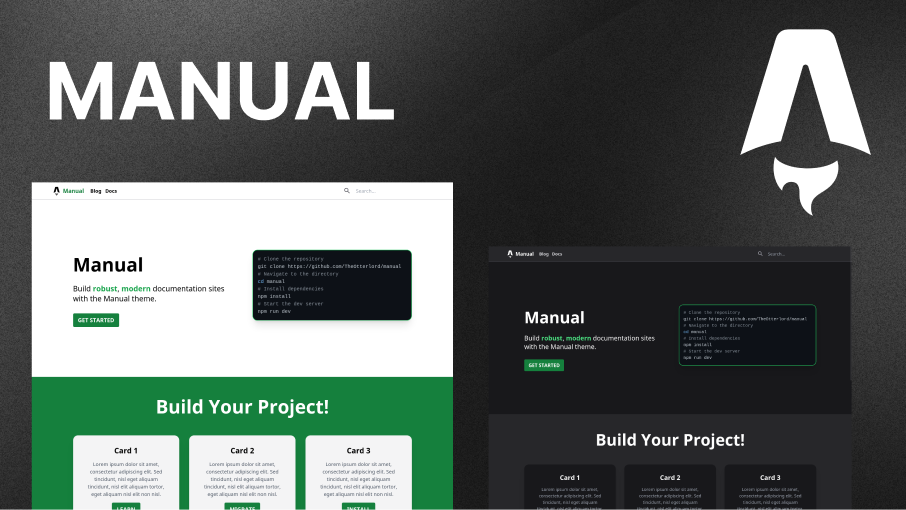

<h3 align=center>
  <code>npx degit TheOtterlord/manual</code>
</h3>

<br/>

<div align=center>
  <a href="https://dsc.gg/otterlord">
    
  </a>
  
  
  <a href="https://developer.stackblitz.com/github/TheOtterlord/manual/tree/main">
    
  </a>
  <a href="https://codesandbox.io/s/github/TheOtterlord/manual/tree/main">
    
  </a>
</div>

<br/>



## 🚀 Getting Started

Once you've downloaded the template with `npx degit TheOtterlord/manual`, install dependencies and start the dev server:

```bash
npm install
npm run dev
```

## 📚 Features

- [Astro](https://astro.build) - Blazingly fast static site generation & type-safe frontmatter
- [Tailwind CSS](https://tailwindcss.com) - Quick & efficient styling
- [Pagefind](https://pagefind.app) - Powering static search
- [RSS](https://en.wikipedia.org/wiki/RSS) - Syndication feed
- [OpenGraph](https://ogp.me) - Social media previews (including procedurally generated images)

## 📁 Project Structure

Inside your project, you'll see the following useful folders and files:

```
/
├── public/
│   └── favicon.svg
├── src/
│   ├── components/
│   │   └── Navigation.astro
│   ├── content/
│   │   ├── blog/
│   │   ├── docs/
│   |   └── config.ts
│   ├── layouts/
│   │   ├── Base.astro
│   │   ├── Blog.astro
│   │   └── Docs.astro
│   ├── lib/
│   ├── pages/
│   │   ├── blog/
│   │   |   ├── [id].astro
│   │   |   └── index.astro
│   │   ├── docs/
│   │   |   └── [...id].astro
│   │   ├── images/
│   │   |   └── [...id].png.ts
│   │   ├── 404.astro
│   │   ├── index.astro
│   │   └── rss.xml.ts
│   └── site_config.ts
├── astro.config.mjs
├── package.json
└── tailwind.config.js
```

Content is stored in the `src/content` folder. This is where you'll find your blog posts (`blogs/`), documentation (`docs/`), and configuration (`config.ts`). The `config.ts` file is where the frontmatter type definitions are made.

OpenGraph images are procedurally generated from the `src/pages/images` folder. You can change the default image by editing the HTML defined in `src/pages/images/[...id].png.ts`.

## 📝 License

Manual is licensed under the [MIT License](LICENSE).
