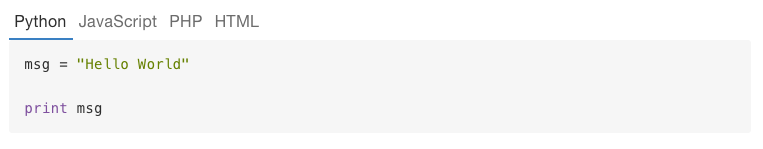

# mdtabs

A fork of codetabs that renders markdown in tab body so you have more flexibility.


### Installation

Adds the plugin to your `book.json`, then run `gitbook install` if you are building your book locally.

```js
{
    "plugins": ["mdtabs"]
}
```

### Usage

<pre lang="markdown">
<code>
This is a code block with tabs for each languages:


## can have headers here
```python
msg = "Hello World"
print msg
```

```js
var msg = "Hello World";
console.log(msg);
```

```html
<b>Hello World</b>
```

</code>
</pre>
